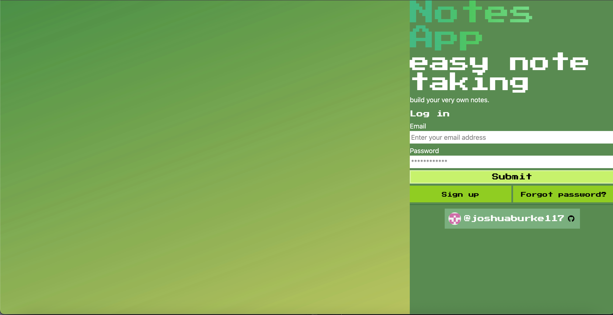
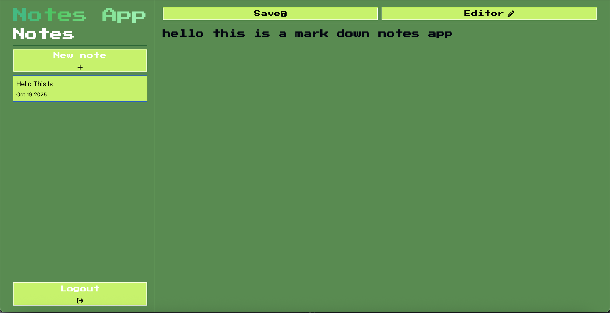

# about this project
this markdown notes app was created from a tutorial from [smoljames]("https://smoljames.com/")
after completing his tutorial i continued on and restyled the project using tailwind css
i also added a few other features that wern't covered under his tutorial these include
*Implement the reset password feature

# purpose of project
to gain experience in:
node.js and react.js
and styling the frontend using tailwind

## things i learnt during the project
learnt about state variables, and how children elemets interact with them
learnt about event listeners and how to implement them, and configure them
learnt how to implment firebase authentication, and firebase database
and how to deploy a web application onto the web
learnt how to keep api keys safe using .env files
learnt how to taylor content to the size of the device, this includes hiding content when not needed, pinning content when the page gets big

## what the project looks like
login page

markdown veiwer 

# Things i still want to do
Custom file names
Search filter in side nav for documents
Create a more comprehensive landing page
Manage login error states with appropriate conditionally rendered error messages
